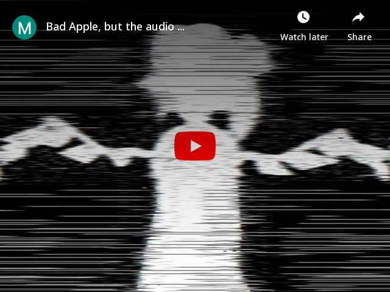

# Databending with FFmpeg: Misinterpreting Audio as Video for Fun and Profit
[(Index)](https://github.com/multiplealiases/Table-of-Contents-Databending-Series/blob/main/README.md)

## Required Software
(These are not strictly needed to achieve the same result; this is just what I know works.)
 - [Python 3.6 or later](https://www.python.org/)
 - [FFmpeg](https://ffmpeg.org/)
 - [SoX (Sound eXchange)](http://sox.sourceforge.net/Main/HomePage)
 - [VLC](https://www.videolan.org/)

## Required Reading
If you wish to follow along, please read and understand these articles first if you haven't already:

- [(The PATH-setting part of) *Databending with FFmpeg: (Ab)using Lossy Audio Compression to Databend Images*](https://github.com/multiplealiases/Databending-With-FFmpeg/blob/main/README.md) by yours truly

This one is Windows-specific, and covers how to temporarily set your PATH to point to your copy of FFmpeg (the same general method applies to SoX and Python). As before, if you already know that part (or you already have FFmpeg, SoX and Python in PATH like I do), you can safely skip it. 

Indeed, if you're a Linux user, you can get yourself copies of all three at your favorite package manager, and it'll all be properly set up without bothering with this PATH-editing nonsense. Consult your documentation for that.

## Suggested Watching

- [*A Digital Media Primer For Geeks*](https://youtu.be/FG9jemV1T7I) ([text version](https://wiki.xiph.org/Videos/A_Digital_Media_Primer_For_Geeks)) by Christopher "Monty" Montgomery and Xiph.org

- [*Digital Show and Tell*](https://youtu.be/cIQ9IXSUzuM) ([text version](https://wiki.xiph.org/Videos/Digital_Show_and_Tell))  by Christopher "Monty" Montgomery and Xiph.org

I will gloss over a lot of terms introduced in the first video. Watch that one for more context.

As for the second one, I'll try to explain when we get to it, but I think the presenter does a much better job at demonstrating the relationship between dynamic range and bit depth than I ever could.

If the information-streams prove to be overwhelming, don't worry. That was the point of both of these; to convey as much information as possible in the "shortest" (~30 minutes each) amount of time. Xiph themselves call it a "firehose of information".

## This is a guided tour through how I discovered this process.

In a first for this series, this is a cross-platform episode! I've checked across Windows, Linux (via Windows Subsystem for Linux 2), and Android (via Termux), and they all work. Just make sure you've installed Python (if you wanna run my scripts), VLC, FFmpeg, and SoX on your system.

This is gonna be a long story. I'm including it because I want to show the process of discovery; I didn't invent this stuff in a day. No-one does.

## Round 1: Bad Apple and the Proof-of-Concept (4th of April, 2021)

 This started off as a project in parallel with video-to-audio databending. I started off playing around with *Bad Apple!!* by Alstroemeria Records featuring Nomico. It's copyrighted, but I'm claiming fair use, since I'm transforming it to the point that there's no way in hell people would watch my video in place of the original.

I'm surprised that hasn't been copyright claimed yet. Maybe the audio's just that crunchy. Either way, it's a good first effort, I think. It was a proof-of-concept. I'll only demonstrate the audio part here, but video will be used if it was a part of the process.

I have the script right here in this repository under as [audio-autoencode.py](scripts/audio-autoencode.py), but I'll run you through the general process. Don't worry, I won't go through this stuff again, instead relying on the scripts to do it for us.

The basic idea I started with was:
~~~ 
               ┌───────┐
               │       │
               │ Input │
               │ audio │
               │       │
               └───────┘

                   │
                   │
                   ▼

          ┌──────────────────┐
          │                  │
          │ Convert audio to │
          │   raw 8-bit PCM  │
          │                  │
          └──────────────────┘

                    │
                    │
                    ▼

     ┌─────────────────────────────┐
     │                             │
     │ Get FFmpeg to interpret the │
     │    raw audio as raw video   │
     │                             │
     └─────────────────────────────┘

                    │
                    │
                    ▼

         ┌──────────────────────┐
         │                      │
         │ Encode it as a video │
         │   in a lossy codec   │
         │                      │
         └──────────────────────┘

                    │
                    │
                    ▼

         ┌──────────────────────┐
         │                      │
         │ Decode "video"  back │
         │     to raw video     │
         │                      │
         └──────────────────────┘

                    │
                    │
                    ▼

  ┌───────────────────────────────────┐
  │                                   │
  │     Get FFmpeg to reinterpret     │
  │ the raw video back into raw audio │
  │                                   │
  └───────────────────────────────────┘

                    │
                    │
                    ▼

     ┌─────────────────────────────┐
     │                             │
     │   Encode it in a lossless   │
     │ audio format  for later use │
     │                             │
     └─────────────────────────────┘

                    │
                    │
                    ▼

┌───────────────────────────────────────┐
│                                       │
│ Convert lossless file to lossy format │
│ (Opus, AAC, MP3...)  for distribution │
│                                       │
└───────────────────────────────────────┘
~~~

"Convoluted" is the key word here. It only gets more convoluted as it goes on, trust me. For the sake of my own sanity, I wrote some scripts to automate this process, but I'd like you to get a feel for what's going on under the hood, at least just once. Copy-and-paste the commands if you want to; I don't mind.

Let's pull out `cmd` (or other terminal app), and navigate to a directory with an audio file we'd like to databend. I'll be using [Axletree's *rheum*](https://freemusicarchive.org/music/Axletree/the-erthe-series-ongoing-project/rheum) because it's a good demonstration piece. Also, it's under CC-BY. Go download the original, and listen to it.

Nice piano piece, good dynamic range. It won't be this good after we push it through the process, trust me. I apologize to Axletree in advance for the butchering that I'm about to do to their music. It's all in the name of databending.

Let's mess with it. An important part of my thought process is that I don't want the encoding step to mess with the audio too badly when using a lossless video codec, in the same way that I use 8-bit unsigned PCM format for my image databending so that the encoding itself doesn't screw with the image. It's not actually possible to get a perfectly lossless encoding, but I hope you think that I've gotten pretty close by the end.

As such, I'll be using lossless video codecs to demonstrate each iteration. I'll include a version encoded with a lossy codec, for those who want to see what it sounds like anyway.

### Step 1
Convert the audio to raw, unsigned 8-bit PCM. The original file is called rheum.mp3.
~~~
ffmpeg -i rheum.mp3 -f u8 rheum-step1.raw
~~~

Input switches:

- `-i rheum.mp3` specifies an input file called "rheum.mp3". No further information is needed here, since MP3 files describe themselves in the header.

All switches after this are for the output.

- `-f u8` specifies a format of unsigned 8-bit PCM audio.
- `rheum-step1.raw` specifies an output file called "rheum-step1.raw". You'll have to write down the sample rate and number of channels for this file. For reference, this one has a 48000 Hz sampling rate and stereo (2 channels). You can find this information using the `ffprobe` tool included with your FFmpeg download.

### Step 2

This step makes FFmpeg misinterpret the raw 8-bit PCM audio as raw video, then encodes it in a lossless video codec. 

~~~
ffmpeg -f rawvideo -r 30 -s 32x32 -pix_fmt rgb24 -i rheum-step1.raw -c:v huffyuv rheum-step2.mkv
~~~

Input switches:

- `-f rawvideo` tells FFmpeg it's a raw video. It's clearly not, but deception is key. Misinterpretation is how you do it.
- `-r 30` sets a framerate of 30 FPS. By default, FFmpeg assumes 30 FPS, but it's better to set it directly, just in case a future version of FFmpeg sets it to something else.
- `-s 32x32` specifies a resolution of 32x32.
- `-i  rheum-step1.raw` sets an input file called "rheum-step1.raw"

The following switches are for the output.

-`-c:v huffyuv` tells FFmpeg to encode the raw video as HuffYUV video. HuffYUV is a lossless format, and one of the easiest compressed lossless formats to work with. I'm aware of other, more efficient lossless formats, but that's a whole 'nother can of worms to set up properly.

-`rheum-step2.mkv` sets an output file called rheum-step2.mkv. MKV is used as the container format, since it lets you put in nearly any combination of audio and video together into a single file.

You'll see errors like

~~~
[rawvideo @ 000002a3bac5f680] Packet corrupt (stream = 0, dts = 5161). speed=   0x
rheum-step1.raw: corrupt input packet in stream 0
[rawvideo @ 000002a3bac6b780] Invalid buffer size, packet size 374 < expected frame_size 3072
Error while decoding stream #0:0: Invalid argument
~~~

but this is entirely normal. Expect the end to be cut off, especially if you increase the resolution; it's just not enough information to fill a full frame at the end of the audio data.

### Step 3

We now decode the compressed video back to raw video. As we all know, though, it's actually audio.

~~~
ffmpeg -i rheum-step2.mkv -f rawvideo -pix_fmt rgb24 rheum-step3.raw
~~~

- `-i rheum-step2.mkv` makes FFmpeg use a file called rheum-step2.mkv as input, which we just made earlier. MKV files are self-describing, so no input parameters need to be given.

The following switches are for the output. 
- `-f rawvideo` sets a format of raw video;
- `-pix_fmt rgb24` sets an output pixel format of 24-bit RGB. This needs to be set here, since some codecs convert to YUV format internally. It'll just sound like noise without it.

### Step 4

~~~
ffmpeg -f u8 -ar 48000 -ac 2 -i rheum-step3.raw -c:a flac rheum-step4.flac
~~~
- `-f u8` sets an input format of unsigned 8-bit PCM. RAW files are not self-describing. You need to tell FFmpeg what its parameters are.
- `-ar 48000` sets an input sampling rate of 48000 Hz. 
- `-ac 2` sets the number of input channels to 2 (stereo).
- `-i rheum-step3.raw` makes FFmpeg use an input file called "rheum-step3.raw", which was produced in the previous step.

The following switches are for the output. 

- `-c:a flac` tells FFmpeg to encode to FLAC format. FLAC is lossless, so it's useful as a mastering format. Don't let anyone tell you FLAC isn't a bit-by-bit perfect reproduction of the original audio. [Here's an article on that topic.](https://opensource.com/article/18/9/comparing-audio-files-flac-wav) (Though there is a risk that FFmpeg might downsample down to 16 bits, but it's not like our audio has any more bits than 8. It's a moot point.)
-  `rheum-step4.flac` sets an output file called "rheum-step4.flac".

### Step 5 (optional, but useful for distribution to the masses*)
*Beware that most services already re-encode audio for download/streaming. It might not be necessary to do this unless you're distributing files directly to the listener like I am.
~~~
ffmpeg -i rheum-step4.flac -c:a libopus -b:a 160k rheum-end.webm
~~~

- `-i rheum-step4.flac` sets an input file called "rheum-step4.flac".

The following switches apply to the output.

- `-c:a libopus` tells FFmpeg to use the libopus encoder. Opus is a free and open-source format that always outperforms MP3 in quality and size efficiency, especially once I get to using the μ-law compander later on. AAC is a possible alternative, but its best encoders are locked behind patents and legal nonsense. I'll use it myself here for compatibility with older Apple devices, however.
- `-b:a 160k` sets a bitrate of 160 kbps for the output.
- `rheum-end.webm` sets an output file called "rheum-end.opus".

For file size and compatibility reasons, I will use Opus and MP3, in that order. Go use the MP3 one if you can't play the Opus version. I suggest installing VLC if neither of them play.

[\[rheum-round1-end.webm, Opus audio @ 160 kbps\]](assets/audio/rheum-round1-end.webm)

[\[rheum-round1-end.mp3, MP3 audio @ 320 kbps\]](assets/audio/rheum-round1-end.mp3)

(These bitrates are hilariously overkill here, I'll admit. I just wanted to make sure you're not losing out on perceptible quality, especially later.)

As you can hear, there's a lot of noise introduced, even when we did nothing. This is what's known in the business as quantization noise. I'll explain in the next round.

Here's what that looks like in Audacity, compared with the original. I've also made the difference signal between them by inverting one of them (it doesn't matter which one), and mixing both tracks down to a new track.

You see how the difference signal is almost steady at around -50 dB? That's quantization noise. Let's zoom in on that.

It's a distracting artifact of the conversion down from 16/24/32-bit PCM to just 8 bits. For the benefit of those of you who don't want to (or can't) repeat what I did, here's what that sounds like. Beware that some players will automatically amplify softer audio like this. Turn down your volume, just in case.

[\[difference-round1.webm, Opus audio @ 160 kbps\]](assets/audio/difference-round1.webm)

[\[difference-round1.mp3, MP3 audio @ 320 kbps\]](assets/audio/difference-round1.mp3)

Oh, and here's the ones compressed with a lossy video codec, H.264 @ 32 kbps.

[\[rheum-round1-libx264-32k-end.webm, Opus audio @ 160 kbps\]](assets/audio/rheum-round1-libx264-32k-end.webm)

[\[rheum-round1-libx264-32k-end.mp3, MP3 audio @ 320 kbps\]](assets/audio/rheum-round1-libx264-32k-end.mp3)

The video codec is taking the noise, and it's incorporating it into the compression. I'm sure there's a use for this, but my perfectionist self won't accept it. 

To do the lossy version, modify step 2 (and adjust the later steps accordingly) to:

~~~
ffmpeg -f rawvideo -r 30 -s 32x32 -pix_fmt rgb24 -i rheum-step1.raw -c:v libx264 -b:v 16k rheum-libx264-16k-step2.mkv
~~~

I'll only annotate the switches that have changed from the original step 2.

- `-c:v libx264` sets a video encoder of libx264, a H.264 encoder. About the only one you'd actually see in practice, unless you go ahead and compile your own FFmpeg with every single encoder available. [Here's a Batch script that'll do just that, for the Windows users among you.](https://github.com/m-ab-s/media-autobuild_suite)
- `-b:v 16k` sets an (average) bitrate of 16 kbps.

## Round 1.5: The Deal With Quantization Noise

### 12th of April, 2021

You know how the Round 1 ones had issues with rather excessive noise? It's good enough for Bad Apple (since that is a very "loud" song), but it's awful once I started doing, say, a movie. This is Big Buck Bunny, which is (c) copyright 2008, Blender Foundation / www.bigbuckbunny.org. It's under CC-BY 3.0.

Yeah, yeah, leave the Big Chungus jokes at the door. I picked out this movie because it was the second movie in the [Xiph lossless test media repository](https://media.xiph.org/). The first one in there is [Elephant's Dream](https://youtu.be/ePVe9FzuFfQ), and I understood none of that. Too spooky. I'd figured I'd go for something a bit more lighthearted, at least on the surface.

The best way to get the audio is to just get it from that Xiph repository. It's a smaller file size, anyway, and I doubt that the services you'd want to upload your files to would let you upload surround sound without downmixing to stereo. I'd suggest also getting the y4m 360p compressed raw video so that you have some visuals to go along with it. I know it's 1.1 GB (4.6 GB uncompressed), but I think it's the only way you can guarantee that the video is properly synced with the audio.

Let's just use the `audio-autoencode_round1.py` script with a lossless video codec. I'm not repeating that long process again. The commands for that, once you've pasted in the script into the directory with the movie audio (+ video) and put FFmpeg in PATH, are:

~~~
ffmpeg -i BigBuckBunny-stereo.flac -f u8 BigBuckBunny-stereo-u8.raw
~~~
~~~
python audio-autoencode.py 48000 2 BigBuckBunny-stereo-u8.raw huffyuv 1k 32x32
~~~

Step 1 (converting input audio to unsigned 8-bit PCM) isn't automated in this earliest script. All later ones will. Keep in mind there's no error-checking, but it's not the end of the world if it does error out. It doesn't overwrite the original files at all. Here's what the output looks like (minus the color):

~~~
> python audio-autoencode_round1.py 48000 2 BigBuckBunny-stereo-u8.raw huffyuv 1k 32x32

['audio-autoencode_round1.py', '48000', '2', 'BigBuckBunny-stereo-u8.raw', 'huffyuv', '1k', '32x32']

['ffmpeg', '-y', '-f', 'rawvideo', '-s', '32x32', '-r', '30', '-pix_fmt', 'rgb24', '-i', 'BigBuckBunny-stereo-u8.raw', '-c:v', 'huffyuv', '-b:v', '1k', 'BigBuckBunny-stereo-u8-huffyuv-1k-32x32.mkv']

ffmpeg version 2021-05-09-git-8649f5dca6-full_build-www.gyan.dev Copyright (c) 2000-2021 the FFmpeg developers
  built with gcc 10.2.0 (Rev6, Built by MSYS2 project)
  configuration: --enable-gpl --enable-version3 --enable-static --disable-w32threads --disable-autodetect --enable-fontconfig --enable-iconv --enable-gnutls --enable-libxml2 --enable-gmp --enable-lzma --enable-libsnappy --enable-zlib --enable-librist --enable-libsrt --enable-libssh --enable-libzmq --enable-avisynth --enable-libbluray --enable-libcaca --enable-sdl2 --enable-libdav1d --enable-libzvbi --enable-librav1e --enable-libsvtav1 --enable-libwebp --enable-libx264 --enable-libx265 --enable-libxvid --enable-libaom --enable-libopenjpeg --enable-libvpx --enable-libass --enable-frei0r --enable-libfreetype --enable-libfribidi --enable-libvidstab --enable-libvmaf --enable-libzimg --enable-amf --enable-cuda-llvm --enable-cuvid --enable-ffnvcodec --enable-nvdec --enable-nvenc --enable-d3d11va --enable-dxva2 --enable-libmfx --enable-libglslang --enable-vulkan --enable-opencl --enable-libcdio --enable-libgme --enable-libmodplug --enable-libopenmpt --enable-libopencore-amrwb --enable-libmp3lame --enable-libshine --enable-libtheora --enable-libtwolame --enable-libvo-amrwbenc --enable-libilbc --enable-libgsm --enable-libopencore-amrnb --enable-libopus --enable-libspeex --enable-libvorbis --enable-ladspa --enable-libbs2b --enable-libflite --enable-libmysofa --enable-librubberband --enable-libsoxr --enable-chromaprint
  libavutil      57.  0.100 / 57.  0.100
  libavcodec     59.  1.100 / 59.  1.100
  libavformat    59.  0.101 / 59.  0.101
  libavdevice    59.  0.100 / 59.  0.100
  libavfilter     8.  0.101 /  8.  0.101
  libswscale      6.  0.100 /  6.  0.100
  libswresample   4.  0.100 /  4.  0.100
  libpostproc    56.  0.100 / 56.  0.100
[rawvideo @ 000002474da4f0c0] Estimating duration from bitrate, this may be inaccurate
Input #0, rawvideo, from 'BigBuckBunny-stereo-u8.raw':
  Duration: 00:10:21.30, start: 0.000000, bitrate: 737 kb/s
  Stream #0:0: Video: rawvideo (RGB[24] / 0x18424752), rgb24, 32x32, 737 kb/s, 30 tbr, 30 tbn
Stream mapping:
  Stream #0:0 -> #0:0 (rawvideo (native) -> huffyuv (native))
Press [q] to stop, [?] for help
Output #0, matroska, to 'BigBuckBunny-stereo-u8-huffyuv-1k-32x32.mkv':
  Metadata:
    encoder         : Lavf59.0.101
  Stream #0:0: Video: huffyuv (HFYU / 0x55594648), rgb24(progressive), 32x32, q=2-31, 1 kb/s, 30 fps, 1k tbn
    Metadata:
      encoder         : Lavc59.1.100 huffyuv
[rawvideo @ 000002474da4f0c0] Packet corrupt (stream = 0, dts = 18639).5.3kbits/s speed=1.01e+03x
BigBuckBunny-stereo-u8.raw: corrupt input packet in stream 0
[rawvideo @ 000002474da5b240] Invalid buffer size, packet size 992 < expected frame_size 3072
Error while decoding stream #0:0: Invalid argument
frame=18639 fps=0.0 q=-0.0 Lsize=   39960kB time=00:10:21.26 bitrate= 526.9kbits/s speed= 845x
video:39326kB audio:0kB subtitle:0kB other streams:0kB global headers:0kB muxing overhead: 1.610736%

['ffmpeg', '-y', '-i', 'BigBuckBunny-stereo-u8-huffyuv-1k-32x32.mkv', '-f', 'rawvideo', '-r', '30', '-pix_fmt', 'rgb24', 'BigBuckBunny-stereo-u8-conv-huffyuv-1k-32x32.raw']

ffmpeg version 2021-05-09-git-8649f5dca6-full_build-www.gyan.dev Copyright (c) 2000-2021 the FFmpeg developers
  built with gcc 10.2.0 (Rev6, Built by MSYS2 project)
  configuration: --enable-gpl --enable-version3 --enable-static --disable-w32threads --disable-autodetect --enable-fontconfig --enable-iconv --enable-gnutls --enable-libxml2 --enable-gmp --enable-lzma --enable-libsnappy --enable-zlib --enable-librist --enable-libsrt --enable-libssh --enable-libzmq --enable-avisynth --enable-libbluray --enable-libcaca --enable-sdl2 --enable-libdav1d --enable-libzvbi --enable-librav1e --enable-libsvtav1 --enable-libwebp --enable-libx264 --enable-libx265 --enable-libxvid --enable-libaom --enable-libopenjpeg --enable-libvpx --enable-libass --enable-frei0r --enable-libfreetype --enable-libfribidi --enable-libvidstab --enable-libvmaf --enable-libzimg --enable-amf --enable-cuda-llvm --enable-cuvid --enable-ffnvcodec --enable-nvdec --enable-nvenc --enable-d3d11va --enable-dxva2 --enable-libmfx --enable-libglslang --enable-vulkan --enable-opencl --enable-libcdio --enable-libgme --enable-libmodplug --enable-libopenmpt --enable-libopencore-amrwb --enable-libmp3lame --enable-libshine --enable-libtheora --enable-libtwolame --enable-libvo-amrwbenc --enable-libilbc --enable-libgsm --enable-libopencore-amrnb --enable-libopus --enable-libspeex --enable-libvorbis --enable-ladspa --enable-libbs2b --enable-libflite --enable-libmysofa --enable-librubberband --enable-libsoxr --enable-chromaprint
  libavutil      57.  0.100 / 57.  0.100
  libavcodec     59.  1.100 / 59.  1.100
  libavformat    59.  0.101 / 59.  0.101
  libavdevice    59.  0.100 / 59.  0.100
  libavfilter     8.  0.101 /  8.  0.101
  libswscale      6.  0.100 /  6.  0.100
  libswresample   4.  0.100 /  4.  0.100
  libpostproc    56.  0.100 / 56.  0.100
Input #0, matroska,webm, from 'BigBuckBunny-stereo-u8-huffyuv-1k-32x32.mkv':
  Metadata:
    ENCODER         : Lavf59.0.101
  Duration: 00:10:21.30, start: 0.000000, bitrate: 526 kb/s
  Stream #0:0: Video: huffyuv (HFYU / 0x55594648), bgr0(progressive), 32x32, 30 fps, 30 tbr, 1k tbn (default)
    Metadata:
      ENCODER         : Lavc59.1.100 huffyuv
      DURATION        : 00:10:21.300000000
Stream mapping:
  Stream #0:0 -> #0:0 (huffyuv (native) -> rawvideo (native))
Press [q] to stop, [?] for help
Output #0, rawvideo, to 'BigBuckBunny-stereo-u8-conv-huffyuv-1k-32x32.raw':
  Metadata:
    encoder         : Lavf59.0.101
  Stream #0:0: Video: rawvideo (RGB[24] / 0x18424752), rgb24(pc, progressive), 32x32, q=2-31, 737 kb/s, 30 fps, 30 tbn (default)
    Metadata:
      DURATION        : 00:10:21.300000000
      encoder         : Lavc59.1.100 rawvideo
frame=18639 fps=0.0 q=-0.0 Lsize=   55917kB time=00:10:21.30 bitrate= 737.3kbits/s speed=2.08e+03x
video:55917kB audio:0kB subtitle:0kB other streams:0kB global headers:0kB muxing overhead: 0.000000%

['ffmpeg', '-y', '-f', 'u8', '-ar', '48000', '-ac', '2', '-i', 'BigBuckBunny-stereo-u8-conv-huffyuv-1k-32x32.raw', '-c:a', 'flac', 'BigBuckBunny-stereo-u8-flac-huffyuv-1k-32x32.mkv']

ffmpeg version 2021-05-09-git-8649f5dca6-full_build-www.gyan.dev Copyright (c) 2000-2021 the FFmpeg developers
  built with gcc 10.2.0 (Rev6, Built by MSYS2 project)
  configuration: --enable-gpl --enable-version3 --enable-static --disable-w32threads --disable-autodetect --enable-fontconfig --enable-iconv --enable-gnutls --enable-libxml2 --enable-gmp --enable-lzma --enable-libsnappy --enable-zlib --enable-librist --enable-libsrt --enable-libssh --enable-libzmq --enable-avisynth --enable-libbluray --enable-libcaca --enable-sdl2 --enable-libdav1d --enable-libzvbi --enable-librav1e --enable-libsvtav1 --enable-libwebp --enable-libx264 --enable-libx265 --enable-libxvid --enable-libaom --enable-libopenjpeg --enable-libvpx --enable-libass --enable-frei0r --enable-libfreetype --enable-libfribidi --enable-libvidstab --enable-libvmaf --enable-libzimg --enable-amf --enable-cuda-llvm --enable-cuvid --enable-ffnvcodec --enable-nvdec --enable-nvenc --enable-d3d11va --enable-dxva2 --enable-libmfx --enable-libglslang --enable-vulkan --enable-opencl --enable-libcdio --enable-libgme --enable-libmodplug --enable-libopenmpt --enable-libopencore-amrwb --enable-libmp3lame --enable-libshine --enable-libtheora --enable-libtwolame --enable-libvo-amrwbenc --enable-libilbc --enable-libgsm --enable-libopencore-amrnb --enable-libopus --enable-libspeex --enable-libvorbis --enable-ladspa --enable-libbs2b --enable-libflite --enable-libmysofa --enable-librubberband --enable-libsoxr --enable-chromaprint
  libavutil      57.  0.100 / 57.  0.100
  libavcodec     59.  1.100 / 59.  1.100
  libavformat    59.  0.101 / 59.  0.101
  libavdevice    59.  0.100 / 59.  0.100
  libavfilter     8.  0.101 /  8.  0.101
  libswscale      6.  0.100 /  6.  0.100
  libswresample   4.  0.100 /  4.  0.100
  libpostproc    56.  0.100 / 56.  0.100
[u8 @ 000001b9c697b600] Estimating duration from bitrate, this may be inaccurate
Guessed Channel Layout for Input Stream #0.0 : stereo
Input #0, u8, from 'BigBuckBunny-stereo-u8-conv-huffyuv-1k-32x32.raw':
  Duration: 00:09:56.45, bitrate: 768 kb/s
  Stream #0:0: Audio: pcm_u8, 48000 Hz, stereo, u8, 768 kb/s
Stream mapping:
  Stream #0:0 -> #0:0 (pcm_u8 (native) -> flac (native))
Press [q] to stop, [?] for help
Output #0, matroska, to 'BigBuckBunny-stereo-u8-flac-huffyuv-1k-32x32.mkv':
  Metadata:
    encoder         : Lavf59.0.101
  Stream #0:0: Audio: flac ([172][241][0][0] / 0xF1AC), 48000 Hz, stereo, s16, 128 kb/s
    Metadata:
      encoder         : Lavc59.1.100 flac
size=   14463kB time=00:09:56.44 bitrate= 198.6kbits/s speed= 502x
video:0kB audio:14415kB subtitle:0kB other streams:0kB global headers:0kB muxing overhead: 0.329259%
~~~

It's quite long, yes. That's what happens when you run 3 FFmpeg commands in succession like that; it duplicates a lot of the boilerplate info. You can add `
-hide_banner` and `-loglevel error` to the FFmpeg commands if you want, but I prefer it this way. 

The filenames it makes are in this format (converted to f-strings for readability):
~~~
step1_out = f"{in_filename}-{video_codec}-{bitrate_codec}-{resolution}.mkv"
step2_out = f"{in_filename}-conv-{video_codec}-{bitrate_codec}-{resolution}.raw"
step3_out = f"{in_filename}-{out_audio_codec}-{video_codec}-{bitrate_codec}-{resolution}.mkv"
~~~

Keep in mind that you have to shift the steps up by 1 to match our current notation. Step 1 in the script is Step 2 here, Step 2 there is Step 3 here, and Step 3 there is Step 4 here.

Notice how it prints out the argument list on each command; that's mostly for my benefit, since it helps with debugging the script. I've added newlines for clarity.

I'll quote its help text for the syntax. It's displayed if you just run the script without any arguments.
~~~
Usage: audio-autoencode [sample rate] [no. of channels] [filename w/ extension] [video codec] [bitrate] [internal resolution] 
Please encode your audio as raw 8-bit unsigned PCM first! The screams of the damned will emerge if you don't!
~~~

The second part of that was added later. It's a warning for everyone, since it doesn't automate Step 1.

I'd now suggest muxing (combining media streams into one file) this new audio with the video, so that you can watch it with both audio and video. Lossy codecs are used for compatibility.

~~~
ffmpeg -i BigBuckBunny-stereo-u8-flac-huffyuv-1k-32x32.mkv -i big_buck_bunny_360p24.y4m -c:a aac -b:a 160k -c:v libx264 -crf 18 big-buck-bunny.mp4
~~~

- ` -i BigBuckBunny-stereo-u8-flac-huffyuv-1k-32x32.mkv` and `-i big_buck_bunny_360p24.y4m` define our two input files.

The following arguments apply to the output:

- `-c:a aac` sets the audio encoder to `aac`, FFmpeg's native AAC encoder. It's not bad by any means, just somewhat worse than the best. I'd still suggest Opus if I had the choice.
- `-b:a 160k` sets an audio bitrate of 160 kbps.
- `-c:v libx264` makes FFmpeg use the x264 encoder to encode H.264 video. It's by far the most popular video format, so that's why it's being used here.
- `-crf 18` sets the CRF (constant rate factor) to 18. It's an arbitrary scale, but generally CRF 18 is very good quality. It'll be hard to notice any compression artifacts.
-  `big-buck-bunny.mp4` makes an output file called "big-buck-bunny" using the MP4 container format, as defined by the ".mp4" extension.

And I'll link to a YouTube upload of this movie (with the bitcrushed 8-bit PCM audio) for those who can't run the commands:

It's been subject to YouTube compression, which is pretty bad at lower resolutions. Ignore the video portion; it's not important to what I'm trying to do right now.

You can hear how bad the noise caused by the 8-bit PCM is. It's downright unwatchable. I call this noise "the screams of the damned".

### Enter SoX (16th of April)

My first thought was "dither the audio". But what even is dither? You see, when you just bitcrush audio down to 8 bits, you end up with a difference between the original audio and the bitcrushed audio. This difference is known as quantization noise. People way smarter than me have quantified how high your noise floor (the weakest signal that can be recorded before it gets lost to noise) is, given a bit depth.  This is the equation:

Q represents the bit depth. 1 bit would give you -6 dB, 2 bits -12 dB, 3 bits -18 dB, and so on. CD audio has 16 bits of precision, so its inherent noise floor is -96 dB. That's more-or-less enough for almost all audio if you're only doing playback. You'd want more for editing and mixing, but I'm not covering that here.

In this case, since we had 8-bit PCM, we have a noise floor of -48 dBFS. (Don't get too hung up on the "FS" part; 0 dBFS represents the loudest amplitude possible in a recorded signal, and going down gets you quieter amplitudes.) That is how loud our noise is. The worst part is that it's unpredictable, and it tends to sound vaguely like the original audio.

Let's look at the spectrogram of a part of the quantization noise:

It's mostly noise, but it does sometimes turn into something that's distinctly not-noise. This is distracting. 

Clearly, a solution is needed. There's this wonderful thing called "dither". It's not actually possible to break that -48 dB rule (though I'll show how we can bend it later), but we *can* just add a -48 dB noise signal that has predictable audio characteristics (as opposed to the bitcrushed noise, which is *un*predictable), and that works out perfectly fine.

 Let's update the flowchart:

~~~
                ┌───────┐
                │       │
                │ Input │
                │ audio │
                │       │
                └───────┘

                    │
                    │
                    ▼

           ┌──────────────────┐
           │                  │
           │ Convert audio to │
           │   raw 8-bit PCM  │
           │    and dither    │
           │                  │
           └──────────────────┘

                    │
                    │
                    ▼

     ┌─────────────────────────────┐
     │                             │
     │ Get FFmpeg to interpret the │
     │    raw audio as raw video   │
     │                             │
     └─────────────────────────────┘

                    │
                    │
                    ▼

         ┌──────────────────────┐
         │                      │
         │ Encode it as a video │
         │   in a lossy codec   │
         │                      │
         └──────────────────────┘

                    │
                    │
                    ▼

         ┌──────────────────────┐
         │                      │
         │ Decode "video"  back │
         │     to raw video     │
         │                      │
         └──────────────────────┘

                    │
                    │
                    ▼

  ┌───────────────────────────────────┐
  │                                   │
  │     Get FFmpeg to reinterpret     │
  │ the raw video back into raw audio │
  │                                   │
  └───────────────────────────────────┘

                    │
                    │
                    ▼

     ┌─────────────────────────────┐
     │                             │
     │   Encode it in a lossless   │
     │ audio format  for later use │
     │                             │
     └─────────────────────────────┘

                    │
                    │
                    ▼

┌───────────────────────────────────────┐
│                                       │
│ Convert lossless file to lossy format │
│ (Opus, AAC, MP3...)  for distribution │
│                                       │
└───────────────────────────────────────┘
~~~

More-or-less the same thing, actually, just dithering the audio down to 8-bit, rather than straight-up bitcrushing it. I got so excited to use SoX that I don't think I actually have a script that runs the dithering only. Think of this script as "Round 1.5", never actually used, but given here as an interpolation between stages. The link to this one is [audio-autoencode-dither.py](scripts/audio-autoencode-dither.py)

To repeat the process, run:

~~~
python audio-autoencode-dither-round1_5.py 48000 2 BigBuckBunny-stereo.flac huffyuv 1k 32x32
~~~

And you'll see this output:

~~~
>python audio-autoencode-dither-round1_5.py 48000 2 BigBuckBunny-stereo.flac huffyuv 1k 32x32
['sox', 'BigBuckBunny-stereo.flac', '-r', '48000', '-e', 'unsigned-integer', '-V', '-b', '8', '-c', '2', 'BigBuckBunny-stereo-dither-step0-compressed.raw', 'gain', '-n', '-0.1', 'dither']
sox:      SoX v14.4.2
sox INFO formats: detected file format type `flac'

Input File     : 'BigBuckBunny-stereo.flac'
Channels       : 2
Sample Rate    : 48000
Precision      : 24-bit
Duration       : 00:09:56.46 = 28630000 samples ~ 44734.4 CDDA sectors
File Size      : 110M
Bit Rate       : 1.48M
Sample Encoding: 24-bit FLAC
Endian Type    : little
Reverse Nibbles: no
Reverse Bits   : no

Output File    : 'BigBuckBunny-stereo-dither-step0-compressed.raw'
Channels       : 2
Sample Rate    : 48000
Precision      : 8-bit
Duration       : 00:09:56.46 = 28630000 samples ~ 44734.4 CDDA sectors
Sample Encoding: 8-bit Unsigned Integer PCM
Reverse Nibbles: no
Reverse Bits   : no
Comment        : 'Processed by SoX'

sox INFO sox: effects chain: input        48000Hz  2 channels
sox INFO sox: effects chain: gain         48000Hz  2 channels
sox INFO sox: effects chain: dither       48000Hz  2 channels
sox INFO sox: effects chain: output       48000Hz  2 channels
['ffmpeg', '-y', '-f', 'rawvideo', '-s', '32x32', '-r', '30', '-pix_fmt', 'rgb24', '-i', 'BigBuckBunny-stereo-dither-step0-compressed.raw', '-c:v', 'huffyuv', '-b:v', '1k', 'BigBuckBunny-stereo-dither-step1-huffyuv-1k-32x32.mkv']
ffmpeg version 2021-05-09-git-8649f5dca6-full_build-www.gyan.dev Copyright (c) 2000-2021 the FFmpeg developers
  built with gcc 10.2.0 (Rev6, Built by MSYS2 project)
  configuration: --enable-gpl --enable-version3 --enable-static --disable-w32threads --disable-autodetect --enable-fontconfig --enable-iconv --enable-gnutls --enable-libxml2 --enable-gmp --enable-lzma --enable-libsnappy --enable-zlib --enable-librist --enable-libsrt --enable-libssh --enable-libzmq --enable-avisynth --enable-libbluray --enable-libcaca --enable-sdl2 --enable-libdav1d --enable-libzvbi --enable-librav1e --enable-libsvtav1 --enable-libwebp --enable-libx264 --enable-libx265 --enable-libxvid --enable-libaom --enable-libopenjpeg --enable-libvpx --enable-libass --enable-frei0r --enable-libfreetype --enable-libfribidi --enable-libvidstab --enable-libvmaf --enable-libzimg --enable-amf --enable-cuda-llvm --enable-cuvid --enable-ffnvcodec --enable-nvdec --enable-nvenc --enable-d3d11va --enable-dxva2 --enable-libmfx --enable-libglslang --enable-vulkan --enable-opencl --enable-libcdio --enable-libgme --enable-libmodplug --enable-libopenmpt --enable-libopencore-amrwb --enable-libmp3lame --enable-libshine --enable-libtheora --enable-libtwolame --enable-libvo-amrwbenc --enable-libilbc --enable-libgsm --enable-libopencore-amrnb --enable-libopus --enable-libspeex --enable-libvorbis --enable-ladspa --enable-libbs2b --enable-libflite --enable-libmysofa --enable-librubberband --enable-libsoxr --enable-chromaprint
  libavutil      57.  0.100 / 57.  0.100
  libavcodec     59.  1.100 / 59.  1.100
  libavformat    59.  0.101 / 59.  0.101
  libavdevice    59.  0.100 / 59.  0.100
  libavfilter     8.  0.101 /  8.  0.101
  libswscale      6.  0.100 /  6.  0.100
  libswresample   4.  0.100 /  4.  0.100
  libpostproc    56.  0.100 / 56.  0.100
[rawvideo @ 0000019ef500b540] Estimating duration from bitrate, this may be inaccurate
Input #0, rawvideo, from 'BigBuckBunny-stereo-dither-step0-compressed.raw':
  Duration: 00:10:21.30, start: 0.000000, bitrate: 737 kb/s
  Stream #0:0: Video: rawvideo (RGB[24] / 0x18424752), rgb24, 32x32, 737 kb/s, 30 tbr, 30 tbn
Stream mapping:
  Stream #0:0 -> #0:0 (rawvideo (native) -> huffyuv (native))
Press [q] to stop, [?] for help
Output #0, matroska, to 'BigBuckBunny-stereo-dither-step1-huffyuv-1k-32x32.mkv':
  Metadata:
    encoder         : Lavf59.0.101
  Stream #0:0: Video: huffyuv (HFYU / 0x55594648), rgb24(progressive), 32x32, q=2-31, 1 kb/s, 30 fps, 1k tbn
    Metadata:
      encoder         : Lavc59.1.100 huffyuv
[rawvideo @ 0000019ef500b540] Packet corrupt (stream = 0, dts = 18639).8.9kbits/s speed=1.01e+03x
BigBuckBunny-stereo-dither-step0-compressed.raw: corrupt input packet in stream 0
[rawvideo @ 0000019ef502b340] Invalid buffer size, packet size 992 < expected frame_size 3072
Error while decoding stream #0:0: Invalid argument
frame=18639 fps=0.0 q=-0.0 Lsize=   40049kB time=00:10:21.26 bitrate= 528.1kbits/s speed= 843x
video:39415kB audio:0kB subtitle:0kB other streams:0kB global headers:0kB muxing overhead: 1.607743%
['ffmpeg', '-y', '-i', 'BigBuckBunny-stereo-dither-step1-huffyuv-1k-32x32.mkv', '-f', 'rawvideo', '-r', '30', '-pix_fmt', 'rgb24', 'BigBuckBunny-stereo-dither-step2-huffyuv-1k-32x32.raw']
ffmpeg version 2021-05-09-git-8649f5dca6-full_build-www.gyan.dev Copyright (c) 2000-2021 the FFmpeg developers
  built with gcc 10.2.0 (Rev6, Built by MSYS2 project)
  configuration: --enable-gpl --enable-version3 --enable-static --disable-w32threads --disable-autodetect --enable-fontconfig --enable-iconv --enable-gnutls --enable-libxml2 --enable-gmp --enable-lzma --enable-libsnappy --enable-zlib --enable-librist --enable-libsrt --enable-libssh --enable-libzmq --enable-avisynth --enable-libbluray --enable-libcaca --enable-sdl2 --enable-libdav1d --enable-libzvbi --enable-librav1e --enable-libsvtav1 --enable-libwebp --enable-libx264 --enable-libx265 --enable-libxvid --enable-libaom --enable-libopenjpeg --enable-libvpx --enable-libass --enable-frei0r --enable-libfreetype --enable-libfribidi --enable-libvidstab --enable-libvmaf --enable-libzimg --enable-amf --enable-cuda-llvm --enable-cuvid --enable-ffnvcodec --enable-nvdec --enable-nvenc --enable-d3d11va --enable-dxva2 --enable-libmfx --enable-libglslang --enable-vulkan --enable-opencl --enable-libcdio --enable-libgme --enable-libmodplug --enable-libopenmpt --enable-libopencore-amrwb --enable-libmp3lame --enable-libshine --enable-libtheora --enable-libtwolame --enable-libvo-amrwbenc --enable-libilbc --enable-libgsm --enable-libopencore-amrnb --enable-libopus --enable-libspeex --enable-libvorbis --enable-ladspa --enable-libbs2b --enable-libflite --enable-libmysofa --enable-librubberband --enable-libsoxr --enable-chromaprint
  libavutil      57.  0.100 / 57.  0.100
  libavcodec     59.  1.100 / 59.  1.100
  libavformat    59.  0.101 / 59.  0.101
  libavdevice    59.  0.100 / 59.  0.100
  libavfilter     8.  0.101 /  8.  0.101
  libswscale      6.  0.100 /  6.  0.100
  libswresample   4.  0.100 /  4.  0.100
  libpostproc    56.  0.100 / 56.  0.100
Input #0, matroska,webm, from 'BigBuckBunny-stereo-dither-step1-huffyuv-1k-32x32.mkv':
  Metadata:
    ENCODER         : Lavf59.0.101
  Duration: 00:10:21.30, start: 0.000000, bitrate: 528 kb/s
  Stream #0:0: Video: huffyuv (HFYU / 0x55594648), bgr0(progressive), 32x32, 30 fps, 30 tbr, 1k tbn (default)
    Metadata:
      ENCODER         : Lavc59.1.100 huffyuv
      DURATION        : 00:10:21.300000000
Stream mapping:
  Stream #0:0 -> #0:0 (huffyuv (native) -> rawvideo (native))
Press [q] to stop, [?] for help
Output #0, rawvideo, to 'BigBuckBunny-stereo-dither-step2-huffyuv-1k-32x32.raw':
  Metadata:
    encoder         : Lavf59.0.101
  Stream #0:0: Video: rawvideo (RGB[24] / 0x18424752), rgb24(pc, progressive), 32x32, q=2-31, 737 kb/s, 30 fps, 30 tbn (default)
    Metadata:
      DURATION        : 00:10:21.300000000
      encoder         : Lavc59.1.100 rawvideo
frame=18639 fps=0.0 q=-0.0 Lsize=   55917kB time=00:10:21.30 bitrate= 737.3kbits/s speed=1.94e+03x
video:55917kB audio:0kB subtitle:0kB other streams:0kB global headers:0kB muxing overhead: 0.000000%
['sox', '-r', '48000', '-e', 'unsigned-integer', '-V', '-b', '8', '-c', '2', 'BigBuckBunny-stereo-dither-step2-huffyuv-1k-32x32.raw', '-b', '24', '-c', '2', 'BigBuckBunny-stereo-dither-huffyuv-1k-32x32.flac', 'gain', '-n', '-0.1']
sox:      SoX v14.4.2

Input File     : 'BigBuckBunny-stereo-dither-step2-huffyuv-1k-32x32.raw'
Channels       : 2
Sample Rate    : 48000
Precision      : 8-bit
Duration       : 00:09:56.45 = 28629504 samples ~ 44733.6 CDDA sectors
File Size      : 57.3M
Bit Rate       : 768k
Sample Encoding: 8-bit Unsigned Integer PCM
Reverse Nibbles: no
Reverse Bits   : no

sox INFO flac: encoding at 24 bits per sample

Output File    : 'BigBuckBunny-stereo-dither-huffyuv-1k-32x32.flac'
Channels       : 2
Sample Rate    : 48000
Precision      : 24-bit
Duration       : 00:09:56.45 = 28629504 samples ~ 44733.6 CDDA sectors
Sample Encoding: 24-bit FLAC
Endian Type    : little
Reverse Nibbles: no
Reverse Bits   : no
Comment        : 'Processed by SoX'

sox INFO sox: effects chain: input        48000Hz  2 channels
sox INFO sox: effects chain: gain         48000Hz  2 channels
sox INFO sox: effects chain: output       48000Hz  2 channels
~~~

And combine the new audio with video:

~~~
ffmpeg -i BigBuckBunny-stereo-dither-huffyuv-1k-32x32.flac -i big_buck_bunny_360p24.y4m -c:a aac -b:a 160k -c:v libx264 -crf 18 big-buck-bunny-dithered.mp4
~~~

So now our audio is now dithered. It sounds as if you recorded the movie's audio onto cassette tape, which probably isn't the worst thing, but I want as close as possible to lossless, damn it! That, and you get this when you add a lossy video codec into the mix:

[\[BigBuckBunny-stereo-dither-libx264-32k-32x32.webm\]](/assets/audio/BigBuckBunny-stereo-dither-libx264-32k-32x32.webm)

[\[BigBuckBunny-stereo-dither-libx264-32k-32x32.mp3\]](/assets/audio/BigBuckBunny-stereo-dither-libx264-32k-32x32.mp3)

Again, the video codec's incorporating the noise into the bitcrushed audio, which is certainly not how I'd like my audio. I'd prefer it to be bitcrushed only while it's actually playing, you get me?

Oh, and here's the difference signal now, under a spectrogram:

Perfectly homogeneous, just like what random noise should be.

## Round 2: Primitive Compander Woes (17th of April)

The script [audio-autoencode-compander.py](scripts/audio-autoencode-compander.py) will be used here.

So clearly there's something wrong here. What if we somehow "compress" the dynamic range of audio as it gets dithered down to 8 bits, and once we're done with it, we just "expand" it on the way out? Stop wondering, since that's called a compander (compressor-expander). It's used in plain-old-telephone-service telephony to transmit voice over an 8-bit channel, in Dolby NR (A, B and C) to lower the noise inherent in magnetic tape, and apparently somewhere in the MP2 standard because I read it in a book somewhere. It's a useful general technique.

I decided to implement a compander, which means the flowchart from before is now:

~~~
                ┌───────┐
                │       │
                │ Input │
                │ audio │
                │       │
                └───────┘

                    │
                    │
                    ▼

           ┌──────────────────┐
           │                  │
           │ Convert audio to │
           │  raw 8-bit  PCM  │
           │   and compress   │
           │                  │
           └──────────────────┘

                    │
                    │
                    ▼

     ┌─────────────────────────────┐
     │                             │
     │ Get FFmpeg to interpret the │
     │    raw audio as raw video   │
     │                             │
     └─────────────────────────────┘

                    │
                    │
                    ▼

         ┌──────────────────────┐
         │                      │
         │ Encode it as a video │
         │   in a lossy codec   │
         │                      │
         └──────────────────────┘

                    │
                    │
                    ▼

         ┌──────────────────────┐
         │                      │
         │ Decode "video"  back │
         │     to raw video     │
         │                      │
         └──────────────────────┘

                    │
                    │
                    ▼

     ┌─────────────────────────────┐
     │                             │
     │   Get SoX to  reinterpret   │
     │  the raw video as raw audio │
     │ expanding it in the process │
     │                             │
     └─────────────────────────────┘

                    │
                    │
                    ▼

     ┌─────────────────────────────┐
     │                             │
     │   Encode it in a lossless   │
     │ audio format  for later use │
     │                             │
     └─────────────────────────────┘

                    │
                    │
                    ▼

┌───────────────────────────────────────┐
│                                       │
│ Convert lossless file to lossy format │
│ (Opus, AAC, MP3...)  for distribution │
│                                       │
└───────────────────────────────────────┘
~~~

Now, I got lazy and implemented a really crappy one at first. I present to you, the most primitive compander possible:

No, I didn't actually do this plot way back when. It's only now that I've discovered the `--plot` option in SoX to plot the curve of a compander, and now I know why it's not very good. I bashed my head against a metaphorical wall trying to figure out SoX's documentation for the compand effect. 

I'd like to note here that if you look at the source code, it specifies an attack and decay of 1 second. This is because it does weird things if you set those to 0. This will be the bane of my existence for a bit as I eventually realize that it should be 0 if I want the companding to be faithful to the original, but only when I plagiarize a better compander curve.

Anyway, let's run:
~~~
audio-autoencode-compander.py 48000 2 BigBuckBunny-stereo.flac huffyuv 1k 32x32
~~~

And that will produce roughly the same terminal output. Don't worry too much about it, it's just doing its magic.

Anyway, the final file in this example is called BigBuckBunny-stereo-1-1-0.01-huffyuv-1k-32x32.flac. I'll give the usual 2 steps here:

[\[BigBuckBunny-stereo-compander-huffyuv-1k-32x32.webm, Opus @ 160 kbps\]](/assets/audio/BigBuckBunny-stereo-compander-huffyuv-1k-32x32.webm)

[\[BigBuckBunny-stereo-compander-huffyuv-1k-32x32.mp3, MP3 @ 320 kbps\]](/assets/audio/BigBuckBunny-stereo-compander-huffyuv-1k-32x32.mp3)

I'm not even sure if the noise has decreased or not. More to the point, it does the thing that dynamic range compression does to audio: make it louder. Observe:

Okay, it's technically quieter, but that's because the start has this burst of noise. What is obvious is that the dynamic range, the difference between the loudest and quietest parts, is clearly much worse. This isn't at all faithful to the source. I tried desperately for days trying to see if there were different attack, decay and delay parameters that would give better results, but then I had to give up after I realized that the script I wrote would end up generating a ludicrous number of files as it went through every possible permutation.

## Round 3 and 4: A Proper Compander
So I basically gave up for a bit. I threw in the towel, and just kept thinking about this problem. And then it hit me:

*What if I used the μ-law compander?*

### μ-law?

It's an algorithm for companding telephone signals. Back in the old days, they could only transmit 8-bit PCM, and the obvious problem with that is that our voices generally have more dynamic range than that. Like, we're not all loud, are we? If granny tried talking over a linear 8-bit PCM channel, her voice would get drowned out in quantization noise! You wouldn't be able to hear her. All you'd hear is a sea of noise, while granny over here's trying desperately to raise her voice so that she'd be heard.

This is obviously a Bad Thing, so smart people realized that they could compand the signal. Compress on one end, expand on the other end. That way, you can still use 8-bit PCM, but still get the benefits of better dynamic range. This does introduce distortion, but it's better than nothing.

There's actually two versions, the continuous (analog) and discrete (digital) versions. I tried just databending by just encoding μ-law files, but that ended up being a bit painful on the ears. That rules out the discrete version. Say hello to the continuous μ-law compression function! No, there's no derivation here, just me experimenting in LaTeX for the first time in a "serious" capacity. Enjoy these equations.

μ = 255, if we're following the standard. Since I'm lazy, I just decided to copy theirs. Hey, if it's good enough for old-school telephony, it's good enough for general audio, right?

That then needs to be converted to dB. That's 20*log_10(x), so it then expands to:

Ah, but now I need the x-axis to become just standard dB, and the y-axis this dB version of F(x). I need a parametric equation, in other words. I'll modify some stuff, and it now becomes 3 things:

Excellent. We now have a thing that can be solved by brute-force. I banged out a little script to plot the μ-law curve, producing both a chart and a very long list of points describing the curve. [Here's the script.](scripts/plot-ulaw.py) It's not a very well-written script, but it works well enough. For those who want to use it and calculate the list of points, run:

~~~
python plot-ulaw.py > output.txt
~~~

Note that this rounds to 2 decimal places by default, doesn't check for duplicates, and the default output is 7.7 megabytes in size. I wanted an absurd amount of precision, that's all. [I have a compressed copy of the output for those who just want the values.](scripts/ulaw-output.zip) I'll declare that as being under public domain, since you can't copyright a set of points for a simple curve, can you? Not that it matters; μ-law is old enough that it's definitely out of patent protection.

It also generates an SVG file of this figure. I'm oddly proud of it for some reason. I've actually cheated a bit by inverting it in Inkscape, exporting to PNG, then removing transparency info. Here it is:

I know it looks like a diagram you'd find in a textbook or research paper, but I think it's quite nice. 

The thing I'd like to point out is that the μ-law algo just barely squeezes 80 dB of dynamic range into a space that should only have 48 dB. It's fitting about 13⅓ bits of dynamic range into the space of 8. I'd say that's pretty good. To be specific, we're near the dynamic range of the earliest CD players; those only had 14-bit DACs and therefore could only produce 14-bit output, achieving 84 dB instead of the standard 96 dB.

It compresses on the input, producing that sorta squished curve. Then, on the output side, it takes the inverse of the μ-law curve, producing a more-or-less linear transfer curve.

With the points in hand (and a bit of tedious Ctrl+F with the results), [I'm ready to unveil the Round 3 script!](scripts/audio-autoencode-ulaw-compander.py)

Oh wait, no, that one's bugged. It only works with my specific custom version of FFmpeg and nothing else. [Here's a fixed version that'll work on anything with FFmpeg.](scripts/AtoVtoA-noatk.py) It's nominally the Round 4 script. The name's actually changed to "AtoVtoA", because I ran out of ideas for notating new versions.

We'll be switching audio files this time. Now, we're using [Night Owl](https://freemusicarchive.org/music/Broke_For_Free/Directionless_EP/Broke_For_Free_-_Directionless_EP_-_01_Night_Owl) by Broke For Free (available under CC-BY 3.0) specifically because I'd like to highlight a problem with the script. I've renamed it to "night-owl.mp3", for anyone wondering. I'd suggest taking a listen to it now, and noticing the timings of the beats on both ears. This will be important later. After that, run:

~~~
python AtoVtoA-noatk.py 44100 2 night-owl.mp3 huffyuv 1k 32x32
~~~

The final output file here is called "night-owl-end-huffyuv-1k-32x32.flac". As usual, I'll provide the standard steps:

[\[things-fall-apart-end-huffyuv-1k-32x32.webm, Opus @ 160 kbps\]](assets/audio/things-fall-apart-end-huffyuv-1k-32x32.webm)

[\[things-fall-apart-end-huffyuv-1k-32x32.mp3, MP3 @ 320 kbps\]](assets/audio/things-fall-apart-end-huffyuv-1k-32x32.mp3)

It sounds normal at first, but 1 minute in, there's stray sounds on the left and right channels, even though the original had them balanced. It's doing some weird clicking. Let's open both the original and the 'bent version in Audacity (I would strongly recommend using your FLAC originals for best results, not the lossy versions here).
You'll probably have to manually align both tracks to each other, then invert the bottom one. Mix and render to new track, and that's the difference signal.

The downloads for the difference signal are here:

[\[things-fall-apart-diff.webm, Opus @ 160 kbps\]](assets/audio/things-fall-apart-diff.webm)

[\[things-fall-apart-diff.mp3, MP3 @ 320 kbps\]](assets/audio/things-fall-apart-diff.mp3)

It's not really very good, is it? Constant clicking is an odd artifact to have.

I noticed that if you set the attack and delay parameters to anything that isn't 0, it sounds normal, but then you have the problem of dynamic range compression messing with the audio. I also played around with attack and delay parameters for a while on my phone (via Termux), but it never seemed to be faithful to the original.

## Round 5: Back to SoX (8th of May 2021)

I agonized over this weird distortion issue. I calculated a more detailed μ-law curve in a revision of that script, but it still didn't disappear. But then it hit me:

*What if FFmpeg's just bugged?* 

Armed with this thought, I went back to using SoX for companding. I still didn't quite understand the syntax, but at least now I can just brute-force it in Python and hope it works. And you know what? It works. Here's a plot of the μ-law compander as implemented in SoX:

That's a thing of beauty. The script now is [AtoVtoA-sox-no-dither.py](scripts/AtoVtoA-sox-no-dither.py). I think it makes some files under the same name as before, so I'd suggest making a subdirectory with just this new script and a new copy of *Things Fall Apart*. Run:

~~~
python AtoVtoA-sox-no-dither.py 44100 2 things-fall-apart.mp3 huffyuv 1k 32x32
~~~

Now, this may or may not work. It depends on your system. Me, I'm running Windows 10, and I get:

~~~
sox FAIL util: Unable to load MAD decoder library (libmad).
sox FAIL formats: can't open input file `things-fall-apart.mp3':
~~~

This means that my copy of SoX is broken, but it also generates an error if you download a song off YouTube and try using it directly. That would output:

~~~
sox FAIL formats: no handler for file extension `webm'
~~~

Or "mp4", or whatever, depending on what you downloaded. This means we'll have to preprocess our files to FLAC format, because that's the only compressed format that SoX consistently reads at all. You could try WAV, but that's uncompressed.  The conversion is accomplished by doing:

~~~
ffmpeg -i things-fall-apart.mp3 -c:a flac things-fall-apart.flac
~~~

This *does not* make the file lossless, not by any sane person's definition. All we've done is encode the lossy files in a lossless format, but the lossy file has already lost information compared to the original master. We're just trying to get SoX to read it. 

With that minor snag out of the way, run:

~~~
python AtoVtoA-sox-no-dither.py 44100 2 things-fall-apart.flac huffyuv 1k 32x32
~~~

The final output is called "things-fall-apart-no-dither-huffyuv-1k-32x32.flac". Here's some lossy versions, for the benefit of those who can't run these:

[\[things-fall-apart-no-dither-huffyuv-1k-32x32.webm, Opus @ 160 kbps\]](assets/audio/things-fall-apart-no-dither-huffyuv-1k-32x32.webm)

[\[things-fall-apart-no-dither-huffyuv-1k-32x32.mp3, MP3 @ 320 kbps\]](assets/audio/things-fall-apart-no-dither-huffyuv-1k-32x32.mp3)

It's got a bit of this buzzing distortion throughout, but I think it's a reasonable sacrifice to make in exchange for dynamic range and normal-sounding audio.

Let's throw in a lossy codec for once. I'll use VP8 this time. Do:

~~~
python AtoVtoA-sox-no-dither.py 44100 2 things-fall-apart.flac libvpx 64k 32x32
~~~

That produces a rather crunchy version of the song. Lossy versions below:

[\[things-fall-apart-no-dither-libvpx-64k-32x32.webm, Opus @ 160 kbps\]](assets/audio/things-fall-apart-no-dither-libvpx-64k-32x32.webm)

[\[things-fall-apart-no-dither-libvpx-64k-32x32.mp3, MP3 @ 320 kbps\]](assets/audio/things-fall-apart-no-dither-libvpx-64k-32x32.mp3)

I think I've been glossing over what the intermediate stuff actually means. Let's actually look.

### Step 1 (Step 0 in the file)
Alright, let's import the file called "things-fall-apart-step0-compressed.raw" into something. It's possible to use FFmpeg for this, but for this one, I think it's better to use Audacity to import the raw 8-bit PCM. It's a more visual approach, you know?

I don't think I need to provide audio for this one. It's just a super-loud version of the original song. It's absolute pain to listen to, yet it technically doesn't clip. If I uploaded this to any streaming service out there, it would get normalized down to a more reasonable level immediately. I think Oasis' *(What's The Story) Morning Glory?* is actually quieter than this! This could be used in memes.

### Step 2 (Step 1 in the file)

Let's look at the video. I've exported 5 seconds of the 32x32 video to GIF and upscaled it to 128x128. 5 seconds here doesn't correspond to 5 seconds in the song, just pointing that out.

The first thing you'll notice is that it's very bright. That's because of the compressor, since we've fed the video codec the compressed Step 1 output. You can also see the bass and treble notes being very literally visualized here.

The way this works is that every frame is basically its own image. Let's just extract frame #1 here.

Since we're working in 24-bit RGB, each of the color components actually encodes one sample of the 8-bit PCM audio. We start from the top-leftmost pixel, go right along the width of the image, then go down 1 pixel once we hit the edge, resetting the "cursor" back to the left edge. Repeat until the video finishes. I made a visualization of the first 5 frames stacked on top of each other to help communicate this idea:

To something interpreting the raw data as audio, it's not much different from just a very long image.

As for what happens with a lossy codec, here's the first 5 seconds of that VP8 version from before:

And a static visualization of the first 5 frames:

It's lost a lot of the fine color detail. For video, it's fine to sacrifice color detail, but since each pixel represents 3 samples of audio here, it's basically downsampled the audio by a factor of 3.  Also, it's posterized what color is left, which decreases the effective bit depth. That's why the audio sounds crunchy at the end.

### Step 3 (Step 2 in the file)
This stage just decodes the encoded video to raw 24-bit RGB. Nothing special here.

## Final script

This is more-or-less just a revision of the Round 5 script, with some degree of error-checking implemented. It tells you if FFmpeg or SoX aren't installed, or both, it enables multithreading in SoX, and it normalizes the Step numbers to follow this article's notation. It's called [A2V2A.py](scripts/A2V2A.py), because I'm creatively bankrupt when it comes to names.

## How do you find video codecs?

FFmpeg provides a list if you run `ffmpeg -codecs`, but that's an awfully long list. The smart way of doing it is to run the output through `grep` or `findstr` to find what we need. Thankfully, it's very simple to find what codecs will work because each codec is listed with a code. My version of FFmpeg was built on the 10th of May 2021, so this might change, but for now, the code looks like this:
~~~
Codecs:
 D..... = Decoding supported
 .E.... = Encoding supported
 ..V... = Video codec
 ..A... = Audio codec
 ..S... = Subtitle codec
 ...I.. = Intra frame-only codec
 ....L. = Lossy compression
 .....S = Lossless compression
 -------
~~~

So what we need is to find "DEV.L", which means encode + decode supported, video codec, and lossy compression. A nice quirk is that it also matches "DEVIL", which adds intra frame-only compression.

For Windows, do:
~~~
ffmpeg -codecs | findstr DEV.L
~~~

For Linux, MacOS, and similar, do:

~~~
ffmpeg -codecs | grep DEV.L
~~~

On FFmpeg 4.24 on Ubuntu 20.04 (WSL), that command produces this output:

~~~
 DEVIL. amv                  AMV Video
 DEVIL. asv1                 ASUS V1
 DEVIL. asv2                 ASUS V2
 DEV.L. av1                  Alliance for Open Media AV1 (decoders: libaom-av1 ) (encoders: libaom-av1 )
 DEV.L. cinepak              Cinepak
 DEVIL. cljr                 Cirrus Logic AccuPak
 DEV.LS dirac                Dirac (encoders: vc2 )
 DEVIL. dnxhd                VC3/DNxHD
 DEVIL. dvvideo              DV (Digital Video)
 DEV.L. flashsv2             Flash Screen Video v2
 DEV.L. flv1                 FLV / Sorenson Spark / Sorenson H.263 (Flash Video) (decoders: flv ) (encoders: flv )
 DEV.L. h261                 H.261
 DEV.L. h263                 H.263 / H.263-1996, H.263+ / H.263-1998 / H.263 version 2 (decoders: h263 h263_v4l2m2m ) (encoders: h263 h263_v4l2m2m )
 DEV.L. h263p                H.263+ / H.263-1998 / H.263 version 2
 DEV.LS h264                 H.264 / AVC / MPEG-4 AVC / MPEG-4 part 10 (decoders: h264 h264_v4l2m2m h264_cuvid ) (encoders: libx264 libx264rgb h264_nvenc h264_omx h264_v4l2m2m h264_vaapi nvenc nvenc_h264 )
 DEVIL. hap                  Vidvox Hap
 DEV.L. hevc                 H.265 / HEVC (High Efficiency Video Coding) (decoders: hevc hevc_v4l2m2m hevc_cuvid ) (encoders: libx265 nvenc_hevc hevc_nvenc hevc_v4l2m2m hevc_vaapi )
 DEVILS jpeg2000             JPEG 2000 (decoders: jpeg2000 libopenjpeg ) (encoders: jpeg2000 libopenjpeg )
 DEVILS jpegls               JPEG-LS
 DEVIL. mjpeg                Motion JPEG (decoders: mjpeg mjpeg_cuvid ) (encoders: mjpeg mjpeg_vaapi )
 DEV.L. mpeg1video           MPEG-1 video (decoders: mpeg1video mpeg1_v4l2m2m mpeg1_cuvid )
 DEV.L. mpeg2video           MPEG-2 video (decoders: mpeg2video mpegvideo mpeg2_v4l2m2m mpeg2_cuvid ) (encoders: mpeg2video mpeg2_vaapi )
 DEV.L. mpeg4                MPEG-4 part 2 (decoders: mpeg4 mpeg4_v4l2m2m mpeg4_cuvid ) (encoders: mpeg4 libxvid mpeg4_v4l2m2m )
 DEV.L. msmpeg4v2            MPEG-4 part 2 Microsoft variant version 2
 DEV.L. msmpeg4v3            MPEG-4 part 2 Microsoft variant version 3 (decoders: msmpeg4 ) (encoders: msmpeg4 )
 DEV.L. msvideo1             Microsoft Video 1
 DEVIL. prores               Apple ProRes (iCodec Pro) (encoders: prores prores_aw prores_ks )
 DEV.L. roq                  id RoQ video (decoders: roqvideo ) (encoders: roqvideo )
 DEV.L. rv10                 RealVideo 1.0
 DEV.L. rv20                 RealVideo 2.0
 DEV.LS snow                 Snow
 DEV.L. svq1                 Sorenson Vector Quantizer 1 / Sorenson Video 1 / SVQ1
 DEV.L. theora               Theora (encoders: libtheora )
 DEV.L. vp8                  On2 VP8 (decoders: vp8 vp8_v4l2m2m libvpx vp8_cuvid ) (encoders: libvpx vp8_v4l2m2m vp8_vaapi )
 DEV.L. vp9                  Google VP9 (decoders: vp9 vp9_v4l2m2m libvpx-vp9 vp9_cuvid ) (encoders: libvpx-vp9 vp9_vaapi )
 DEVILS webp                 WebP (encoders: libwebp_anim libwebp )
 DEV.L. wmv1                 Windows Media Video 7
 DEV.L. wmv2                 Windows Media Video 8
 DEVIL. xface                X-face image
~~~

Your FFmpeg may differ, and some codecs don't support the MKV container format, but that's still a substantial number of codecs to play with. You may also need to adjust the internal resolution parameter for some of these codecs. Happy databending!

## Conclusion

The process of discovery here took me 35 days, and it took me another 25 to complete the first draft of this article. It's the longest databending project I've completed, but I'm happy with the results.

If there's anything you'd like to add or change, fork (and add a pull request) this repository or find my contact info on GitHub at [multiplealiases](https://github.com/multiplealiases). I'm especially worried about dead links; please tell me if there are any.

***

This work (and all files within the folder `/assets` and all of its subdirectories recursively) is licensed under a
[Creative Commons Attribution 4.0 International License][cc-by]
except where stated otherwise. See the file `LICENSE-CC-BY.txt` for details.

[![CC BY 4.0][cc-by-image]][cc-by]

The code in this repository (defined as all files under the folder `/scripts` and all of its subdirectories recursively) is licensed under an
MIT License
except where stated otherwise. See the file `LICENSE-MIT.txt` for details.

[cc-by]: http://creativecommons.org/licenses/by/4.0/
[cc-by-image]: https://i.creativecommons.org/l/by/4.0/88x31.png

